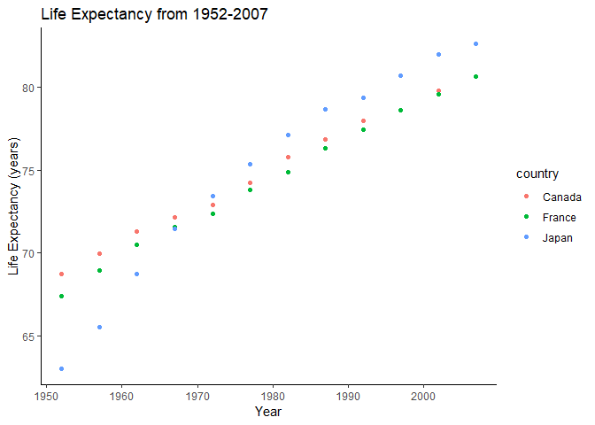

hw004\_ntjjmak
================
Nicole Mak
07/10/2018

### There are two tasks for this assignment.

1.  Data reshaping.
2.  Perform a join.

To start, let’s load the packages to be used for data exploration.

``` r
suppressPackageStartupMessages(library(gapminder))
suppressPackageStartupMessages(library(dplyr))
suppressPackageStartupMessages(library(ggplot2))
suppressPackageStartupMessages(library(tidyr))
suppressPackageStartupMessages(library(knitr))
```

## Exercise \#1: Reshaping data

The data to be used for the exercise is “gapminder”.

Here is the data set in its original form:

``` r
gapminder
```

    ## # A tibble: 1,704 x 6
    ##    country     continent  year lifeExp      pop gdpPercap
    ##    <fct>       <fct>     <int>   <dbl>    <int>     <dbl>
    ##  1 Afghanistan Asia       1952    28.8  8425333      779.
    ##  2 Afghanistan Asia       1957    30.3  9240934      821.
    ##  3 Afghanistan Asia       1962    32.0 10267083      853.
    ##  4 Afghanistan Asia       1967    34.0 11537966      836.
    ##  5 Afghanistan Asia       1972    36.1 13079460      740.
    ##  6 Afghanistan Asia       1977    38.4 14880372      786.
    ##  7 Afghanistan Asia       1982    39.9 12881816      978.
    ##  8 Afghanistan Asia       1987    40.8 13867957      852.
    ##  9 Afghanistan Asia       1992    41.7 16317921      649.
    ## 10 Afghanistan Asia       1997    41.8 22227415      635.
    ## # ... with 1,694 more rows

To practise reshaping the data, I have selected prompt \#2. I have not
yet tried `knitr::kable()`, so this is a good chance. Here are the
exercise instructions:

*Make a tibble with one row per year and columns for life expectancy for
two or more countries. Use `knitr::kable()` to make this table look
pretty in your rendered homework. Take advantage of this new data shape
to scatterplot life expectancy for one country against that of another.*

**First, let’s use `dplyr` to get the information we want to focus on.
We will select for the variables (i.e. columns) we want, make sure it is
grouped by country, and filter only for the countries desired. This will
be stored under “reshape”.**

``` r
reshape <- gapminder %>% 
  select(year, country, lifeExp)%>% 
  group_by(country)%>% 
  filter(country == "Canada" | country == "France" | country == "Japan")
```

**Now we can reformat this so that there is only one row per year and
present this data in a table by using `knitr::kable()`. We will round to
the nearest decimal point.**

Activity \#2 Create your own cheatsheet patterned after Jenny’s but
focused on something you care about more than comics\! Inspirational
examples:

``` r
spread(reshape, key = country, value = lifeExp) %>% 
  knitr:: kable(format = "markdown", justify = "centre", digits = 1, caption = "Life expectancy 1952-2007 for selected countries: Canada, France, and Japan.")
```

| year | Canada | France | Japan |
| ---: | -----: | -----: | ----: |
| 1952 |   68.8 |   67.4 |  63.0 |
| 1957 |   70.0 |   68.9 |  65.5 |
| 1962 |   71.3 |   70.5 |  68.7 |
| 1967 |   72.1 |   71.5 |  71.4 |
| 1972 |   72.9 |   72.4 |  73.4 |
| 1977 |   74.2 |   73.8 |  75.4 |
| 1982 |   75.8 |   74.9 |  77.1 |
| 1987 |   76.9 |   76.3 |  78.7 |
| 1992 |   78.0 |   77.5 |  79.4 |
| 1997 |   78.6 |   78.6 |  80.7 |
| 2002 |   79.8 |   79.6 |  82.0 |
| 2007 |   80.7 |   80.7 |  82.6 |

**This same data may also be presented nicely with a scatter plot.**

``` r
reshape %>% 
  ggplot(aes(year, lifeExp))+
  geom_point(aes(colour = country))+
  theme_classic()+
  ggtitle("Life Expectancy from 1952-2007")+
  ylab("Life Expectancy (years)")+
  xlab("Year")
```

<!-- -->

**The next exercise will be to explore `join`. Here are the instructions
for the exercise: Create your own cheatsheet patterned after Jenny’s but
focused on something you care about more than comics\! **
